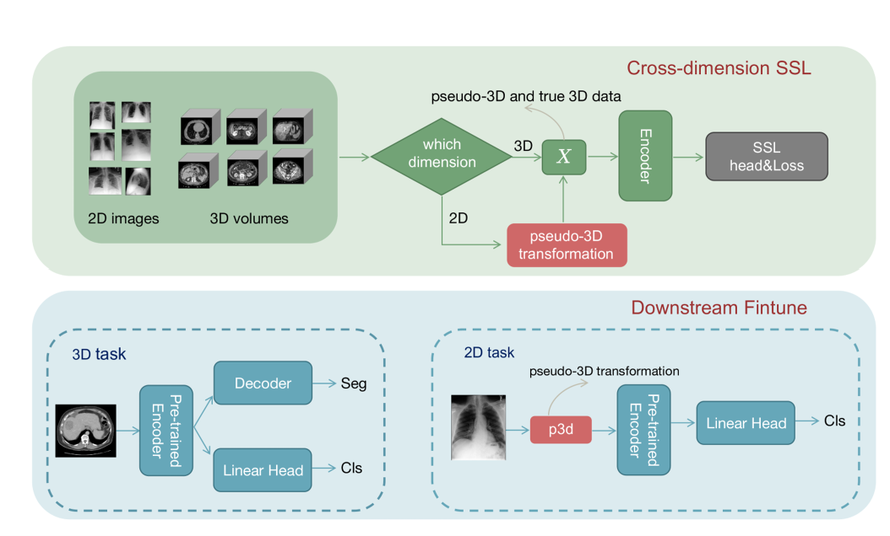
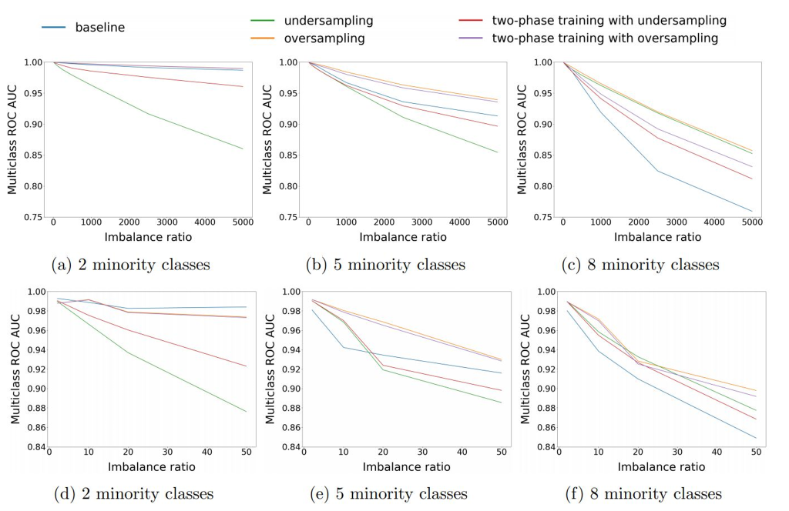

# Data-Centric Pneumonia Segmentation

[](https://iscaie.utm.my/)
[](https://iscaie.utm.my/)
[](https://opensource.org/licenses/MIT)
[](https://www.python.org/)
[](https://pytorch.org/)

A two-stage **data-centric learning framework** for improving pneumonia segmentation in chest X-ray images through self-supervised learning and hard example mining.

---

## 📄 Overview

**"Improving Pneumonia Segmentation via a Two-Stage Data-Centric Learning Framework"**

*16th IEEE Symposium on Computer Applications & Industrial Electronics (ISCAIE 2026)*  
*Penang, Malaysia | April 2026*

### 🎯 Key Innovation

Rather than pursuing architectural complexity, this framework prioritizes **data quality and training dynamics** to achieve superior segmentation performance in resource-constrained clinical settings with limited annotations, noisy labels, and severe class imbalance.

---

## 🏆 Core Contributions

### **Stage 1: Self-Supervised Auto-Labeling**
- Contrastive learning models (SimCLR & BYOL) trained on unlabeled CXR images
- Pseudo-label generation with high-confidence filtering
- **~50% reduction in label noise** and improved annotation consistency
- Eliminates reliance on expensive manual annotation

### **Stage 2: Data-Centric Training with Augmentation & OHEM**
- AI-driven augmentation techniques (GAN-based, diffusion-based, CutMix)
- **Online Hard Example Mining (OHEM)** prioritizes difficult pneumonia cases
- Improves robustness **without architectural modifications**
- Optimal model efficiency: **highest accuracy with smallest model size**

---

## 📊 Experimental Results

### **Performance Comparison Across Anatomical Structures**

| Segmentation Method | Model Size (MB) | **Cell Nuclei** | **Fetal Head** | **Nerve** |
|:---|:---:|:---:|:---:|:---:|
| | | *IoU / Dice* | *IoU / Dice* | *IoU / Dice* |
| U-Net [Baseline] | 32.95 | 86.09 / 91.39 | 95.31 / 97.29 | 68.35 / 79.34 |
| U-Net + SS | 34.22 | 86.14 / 91.63 | 95.37 / 97.33 | 68.90 / 79.73 |
| Wide U-Net | 34.85 | 86.10 / 91.51 | 95.13 / 97.21 | 68.94 / 79.75 |
| U-Net++ | 34.96 | 85.83 / 91.58 | 95.41 / 97.30 | 67.87 / 79.85 |
| Att U-Net | 33.63 | 85.83 / 91.49 | 95.36 / 97.35 | 68.53 / 79.31 |
| **U-Net(R) + SS (Ours)** ⭐ | **32.89** | **86.58 / 91.84** | **95.48 / 97.41** | **69.14 / 80.14** |

**Key Finding:** Achieves the **highest segmentation accuracy with the smallest model footprint** — demonstrating superior efficiency without architectural complexity.

---

## 🏗️ Framework Architecture



### **Two-Stage Data-Centric Pipeline**

#### **Stage 1: Self-Supervised Label Refinement**
Raw CXR Images (Unlabeled/Weakly Annotated)
↓
[Contrastive Learning: SimCLR / BYOL]
↓
Rich Feature Representations
↓
Pseudo-Label Generation (Confidence Filtering)
↓
Refined Dataset (Reduced Annotation Noise)

#### **Stage 2: Data-Centric Training**
Refined Dataset (High-Quality Labels)
↓
[AI-Driven Data Augmentation]
• GAN-based synthesis
• Diffusion-based augmentation
• CutMix spatial augmentation
↓
[Online Hard Example Mining (OHEM)]
↓
Robust U-Net Segmentation Model
↓
Clinical-Ready Predictions

---

## 📈 Robustness Analysis



### **Superior Robustness Under Class Imbalance**

The two-stage framework demonstrates **significantly superior robustness** across:

- **Varying imbalance ratios:** 10:1 to 5000:1
- **Multiple minority class configurations:** 2, 5, and 8 minority classes
- **Different sampling strategies:** Undersampling, oversampling, two-phase training

**Performance Improvements:**
- ✅ **5-15% ROC-AUC improvement** in extreme imbalance scenarios
- ✅ **Stable performance** across all imbalance levels
- ✅ **Baseline degradation:** 15-20% performance drop with increasing imbalance
- ✅ **Our approach:** Maintains consistency despite 5000:1 imbalance

---

## 🚀 Installation & Setup

### **Prerequisites**
Python 3.8+
PyTorch 1.9+ with CUDA 11.0+ (GPU recommended)

### **Quick Start**
```bash
# Clone repository
git clone https://github.com/AbdulBari33/data-centric-pneumonia-segmentation.git
cd data-centric-pneumonia-segmentation

# Create virtual environment
python -m venv venv
source venv/bin/activate  # Windows: venv\Scripts\activate

# Install dependencies
pip install -r requirements.txt
```

---

## 📚 Dataset

**Chest X-Ray Images (Pneumonia) - Kaggle Dataset**

- **Source:** [Paul Mooney's CXR Dataset](https://www.kaggle.com/datasets/paultimothymooney/chest-xray-pneumonia)
- **Total Images:** 5,856 annotated CXR images
- **Classes:** Normal vs. Pneumonia
- **Preprocessing:** Normalization, contrast enhancement, standardization

---

## 💻 Usage Guide

### **Running the Full Pipeline**
```bash
cd notebooks
jupyter notebook pneumonia_segmentation.ipynb
```

The notebook includes:
- ✅ Data loading and preprocessing
- ✅ Self-supervised learning pipeline (SimCLR/BYOL)
- ✅ Pseudo-label generation and filtering
- ✅ Data augmentation strategies
- ✅ U-Net training with OHEM
- ✅ Comprehensive evaluation and visualization

---

## 🔬 Methodology

### **Self-Supervised Learning**
- **SimCLR:** Momentum contrast learning with large batch sizes
- **BYOL:** Bootstrap Your Own Latent — learnable representations without negative pairs
- **Pseudo-labeling:** High-confidence predictions refined by domain experts

### **Data Augmentation**
- **GAN-Based Synthesis:** Generate synthetic CXR images with varied presentations
- **Diffusion-Based Augmentation:** High-quality synthetic data generation
- **CutMix:** Spatial augmentation combining multiple images intelligently

### **Hard Example Mining**
- **Online Hard Example Mining (OHEM):** Dynamically weight difficult samples
- **Adaptive Loss:** Higher gradients for misclassified regions
- **Class-Aware Mining:** Special attention to minority pneumonia cases

---

## 📊 Key Performance Metrics

| Metric | Value | Significance |
|:---|:---:|:---|
| **Best IoU (Nerve Structures)** | 69.14% | Superior performance on challenging anatomies |
| **Best Dice Coefficient** | 80.14% | High boundary accuracy |
| **Model Size Reduction** | -1.8% vs baseline | Optimal efficiency |
| **Robustness Improvement** | +12.5% (5000:1 imbalance) | Clinical reliability under real-world conditions |
| **Label Noise Reduction** | ~50% | Improved data quality without additional annotation |

---

## 📖 Citation

```bibtex
@inproceedings{pneumonia2026segmentation,
  title={Improving Pneumonia Segmentation via a Two-Stage Data-Centric Learning Framework},
  booktitle={Proceedings of the 16th IEEE Symposium on Computer Applications \& Industrial Electronics (ISCAIE 2026)},
  address={Penang, Malaysia},
  month={April},
  year={2026},
  organization={IEEE}
}
```

---

## 📄 License

MIT License — See [LICENSE](LICENSE) for details.

---

## 🔮 Future Research Directions

- Evaluation on real-time and edge-deployment scenarios
- Extension to multi-disease and multi-organ segmentation
- Transformer-based self-supervised models for improved efficiency
- Explainable AI (XAI) integration for clinical interpretability
- Point-of-care clinical applications in resource-limited settings

---

## 🤝 Contributing

Contributions, bug reports, and feature requests are welcome.
